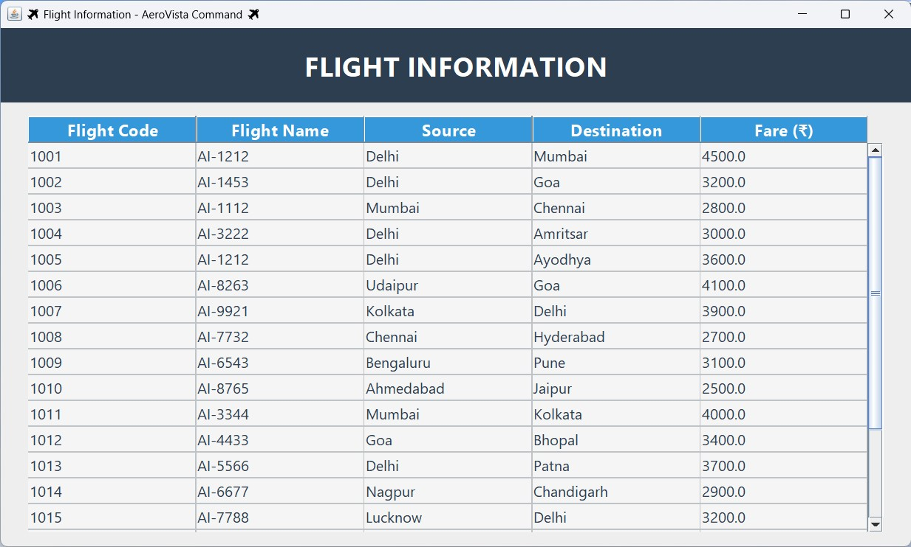
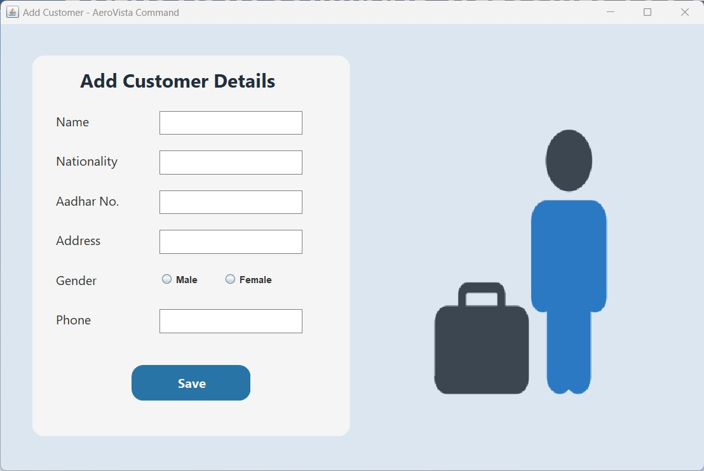
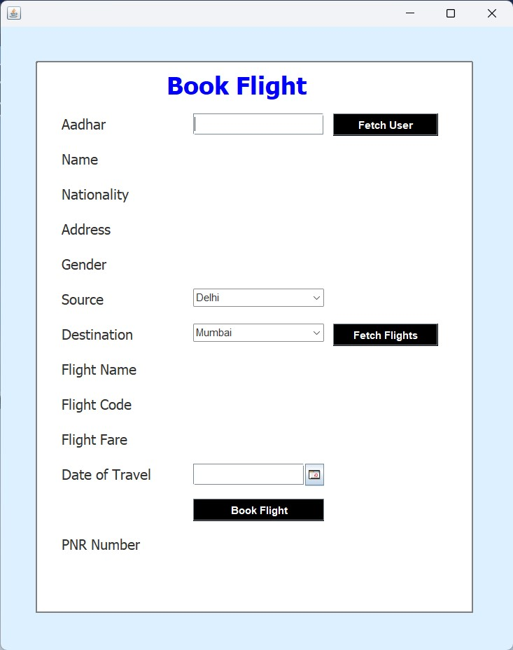
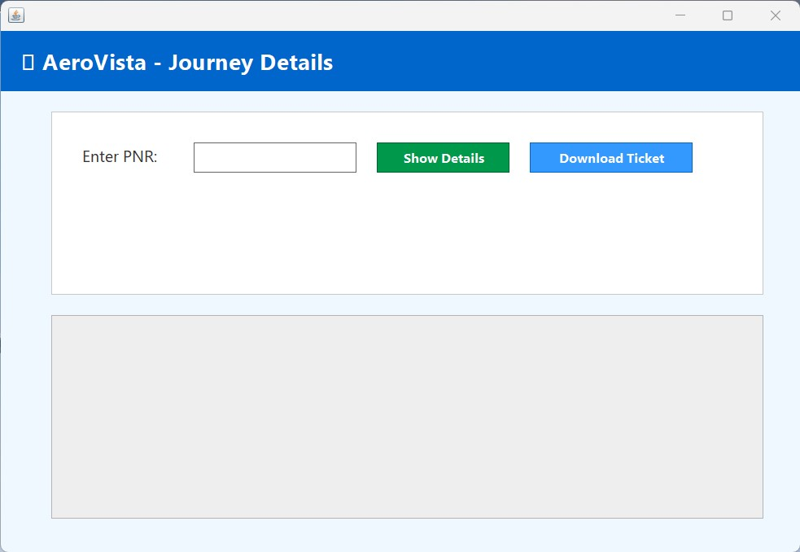
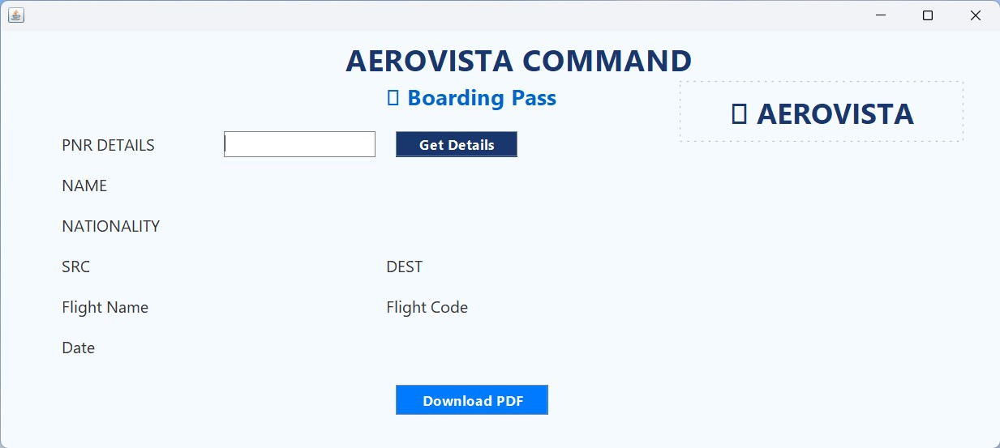
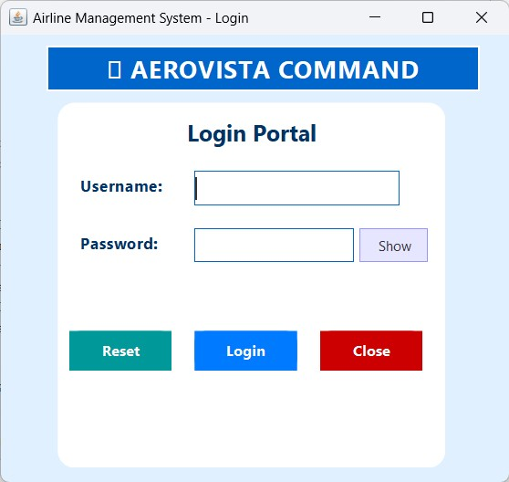

# ✈ Aerovista Airline Management System

Welcome to **Aerovista**, a complete **Java + MySQL** based Airline Reservation System that offers a modern, user-friendly interface to handle flight bookings, customer management, cancellations, and boarding pass generation — all in one place.

---

## 🌐 Live Website

👉 **View the project website**:  
🔗 [Click Here to Explore](https://bskalsi0.github.io/Aerovista_Airline_Management_System/)  
Browse project features, screenshots, and download JAR/SQL files directly from the website.

---

## 📦 Download the Full Project

If you want to download the complete project folder including:
- Java Source Code
- NetBeans Project Setup
- JAR Executables
- MySQL `.sql` file
- Screenshots & Documentation
  
---

## 🖥️ Screenshots

Here are some sample screenshots from the project:

| Home Page | Flight Details | Add Customer |
|----------|----------------|--------------|
|  |  |  |

| Book Flight | Cancel Ticket | Boarding Pass | Login Page |
|------------|----------------|----------------|-------------|
|  |  |  |  |

---

## 🚀 Features

- Add New Flights & Customers
- Book Flights with Payment Confirmation
- Cancel Reserved Tickets
- Generate Stylish Boarding Pass (PDF)
- Integrated Calendar Component
- Lightbox View for Screenshot Previews
- Fully Responsive Website Hosted via GitHub Pages

---

## 🛠️ Technologies Used

| Component      | Technology              |
|----------------|--------------------------|
| Frontend GUI   | Java Swing (NetBeans IDE) |
| Backend Logic  | Java                     |
| Database       | MySQL (Workbench)        |
| Hosting        | GitHub Pages             |
| Styling        | HTML, CSS, JavaScript    |
| Extras         | Lightbox Image Viewer, Download Buttons, PDF Boarding Pass Generator

---

## 📁 Project Structure
📦 Aerovista_Airline_Management_System/
├── 📂 Screenshots/                 # All UI screenshots shown on the website
│   ├── AddCustomer_page.jpg
│   ├── BookFlight_page.jpg
│   ├── CancelTicket_Page.jpg
│   ├── FlightDetails_page.jpg
│   ├── Home_page.jpg
│   ├── Login_Page.jpg
│   └── BordingPass_Page.jpg
│
├── 📂 dist/                        # Final built JAR file
│   └── Aerovista_Project.jar
│
├── 📂 database/                    # MySQL database file
│   └── airlinemanagementsystem.sql
│
├── index.html                     # Interactive website homepage (GitHub Pages)
├── style.css                      # Website styling
├── script.js                      # Website interactivity
├── README.md                      # Project overview and instructions
└── LICENSE                        # MIT License for open-source distribution

---

## 👨‍💻 Author

**Balwinder Singh Kalsi**  
🛠 Passionate Java Developer | Full Stack Enthusiast  
📧 _Feel free to fork, star, or contribute to this project!_

---

## License 📄

The project is available as open source under the terms of the [MIT License](https://github.com/BSKalsi0/Aerovista_Airline_Management_System/blob/main/LICENSE).

---

## Contact 📬
For any inquiries, feedback, or collaboration opportunities, please feel free to reach out to me through my [email](balwindersinghkalsi0@gmail.com) or [LinkedIn](https://www.linkedin.com/in/balwindersinghkalsi/).

